# Install

---

## Install GitLab on Linux

### Add Alibaba Repository ( Only in China )

```bash
sudo sed -e 's|^mirrorlist=|#mirrorlist=|g' -e 's|^#baseurl=http://dl.rockylinux.org/$contentdir|baseurl=https://mirrors.aliyun.com/rockylinux|g' -i.bak /etc/yum.repos.d/rocky*.repo
```
```bash
sudo yum makecache
```

### Download GitLab RPM (Only in China)

```bash
curl -O https://mirrors.tuna.tsinghua.edu.cn/gitlab-ce/yum/el9/gitlab-ce-17.9.7-ce.0.el9.x86_64.rpm
```

### Update Software

```bash
sudo yum update
```

### Install GitLab

```bash
sudo yum install gitlab-ce-17.9.7-ce.0.el9.x86_64.rpm
```

### Configure GitLab

```bash
sudo vim /etc/gitlab/gitlab.rb
```
```bash
external_url 'http://gitlab.example.com' -> external_url 'http://server-ip'
```
```bash
sudo gitlab-ctl reconfigure
```

### Add Service

```bash
sudo firewall-cmd --permanent --add-service={http,https} --permanent
```
```bash
sudo firewall-cmd --reload
```

## Install GitLab on Docker

```
continue...
```

---

# Initial

---

## Login GitLab

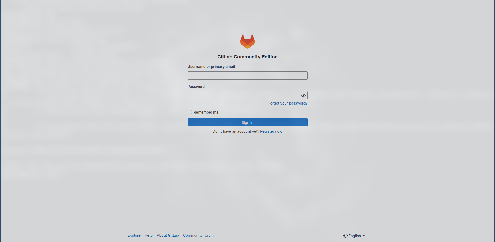

```bash
sudo cat /etc/gitlab/initial_root_password
```

## Change Password

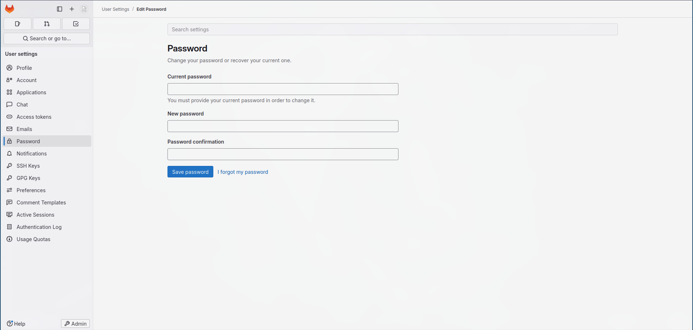

---

# User Icons

## Edit Profile

### Access Tokens

This token will use in jenkins.

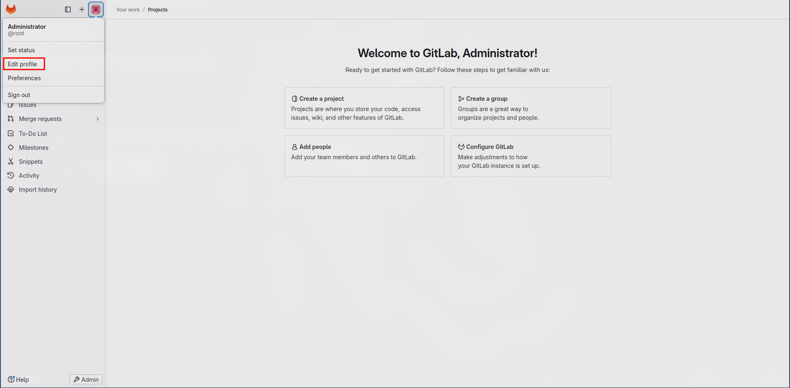
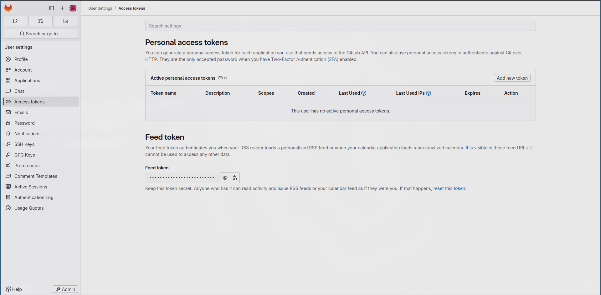


---

# Admin

## Setting

### Network

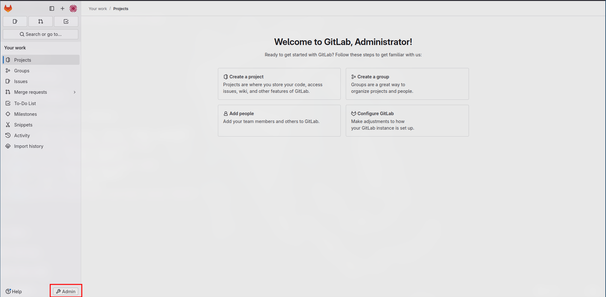
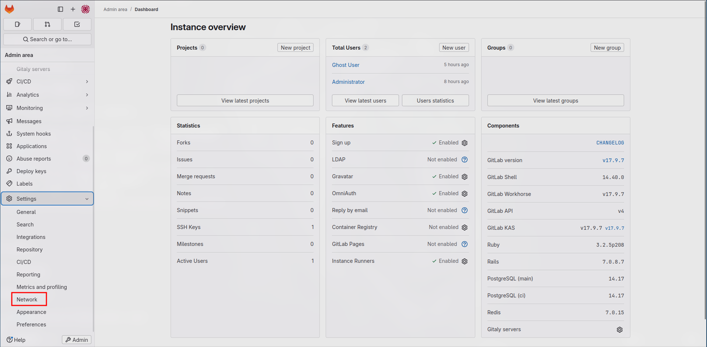
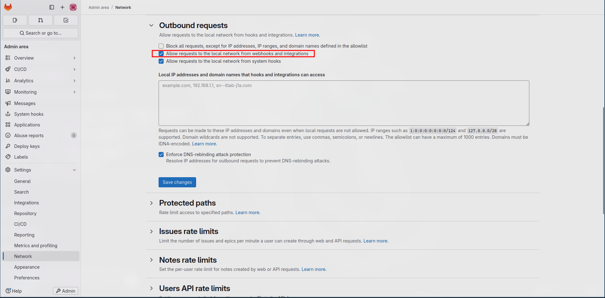

---

# Homepage

## Projects

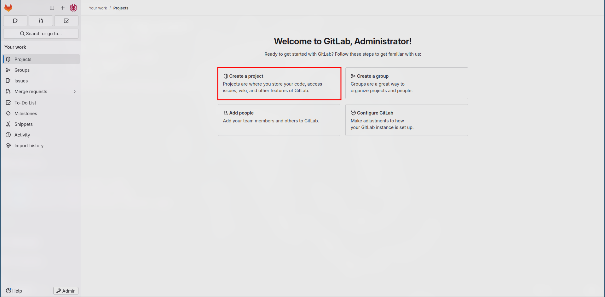
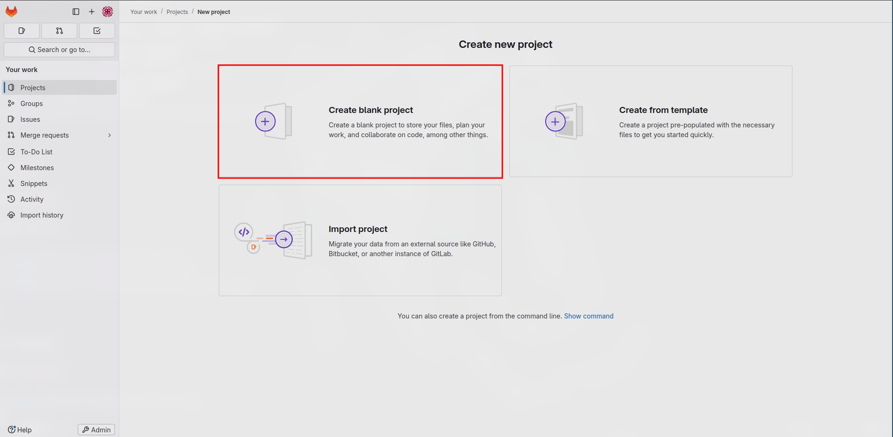
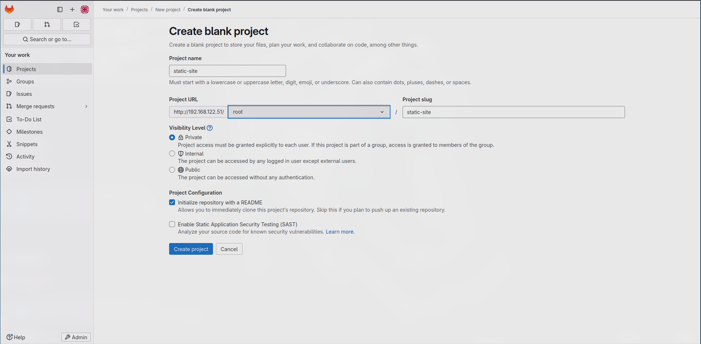
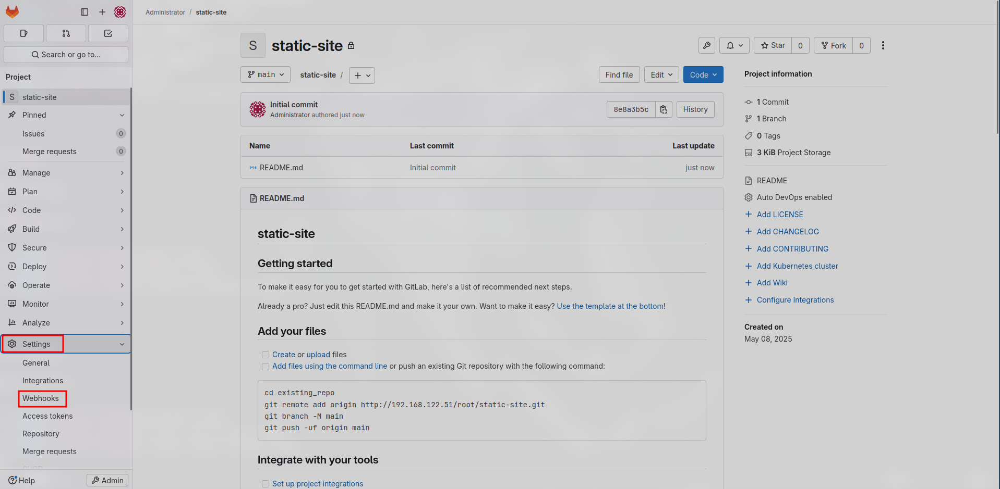

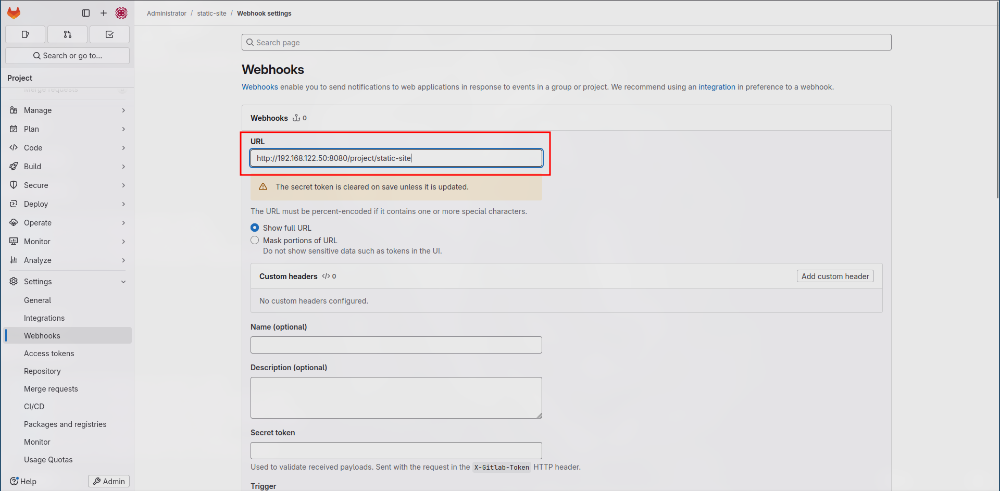
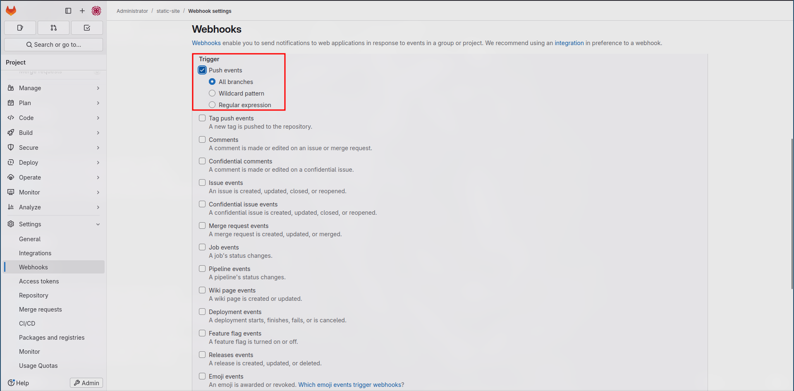
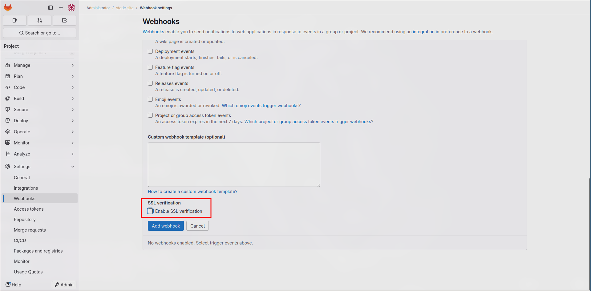
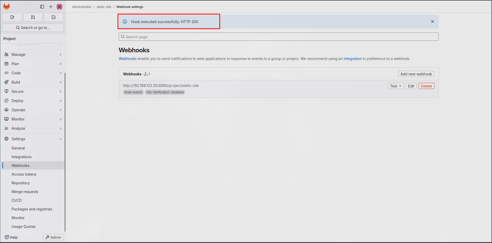

---
