# Install

---

## Install Jenkins on Linux

### Add Alibaba Repository (Only in China)

```bash
sudo sed -e 's|^mirrorlist=|#mirrorlist=|g' -e 's|^#baseurl=http://dl.rockylinux.org/$contentdir|baseurl=https://mirrors.aliyun.com/rockylinux|g' -i.bak /etc/yum.repos.d/rocky*.repo
```
```bash
sudo yum makecache
```

### Add Jenkins Repository

```bash
sudo wget -O /etc/yum.repos.d/jenkins.repo https://pkg.jenkins.io/redhat-stable/jenkins.repo
```
```bash
sudo rpm --import https://pkg.jenkins.io/redhat-stable/jenkins.io-2023.key
```

### Update Software

```bash
sudo yum upgrade
```

### Install Java

```bash
sudo yum install fontconfig java-21-openjdk
```

### Install Jenkins

```bash
sudo yum install jenkins
```

### Start Jenkins

```bash
sudo systemctl enable jenkins
```
```bash
sudo systemctl start jenkins
```

### Add Port

```bash
sudo firewall-cmd --add-port=8080/tcp --permanent
```
```bash
sudo firewall-cmd --reload
```
## Install Jenkins on Docker

```bash
continue...
```

---

# Initial

---

## Unlock Jenkins

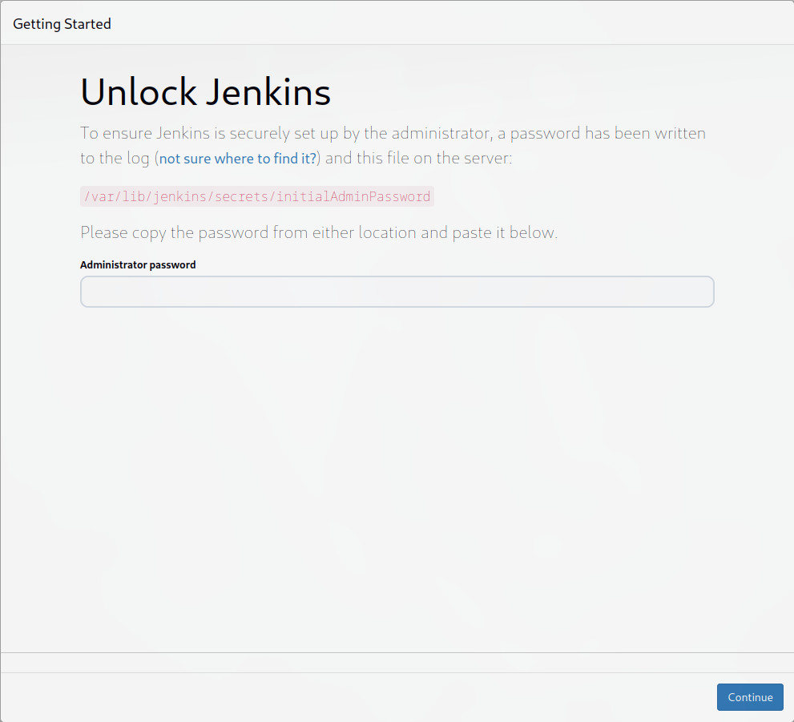

```bash
sudo cat /var/lib/jenkins/secrets/initialAdminPassword
```

## Customize Jenkins

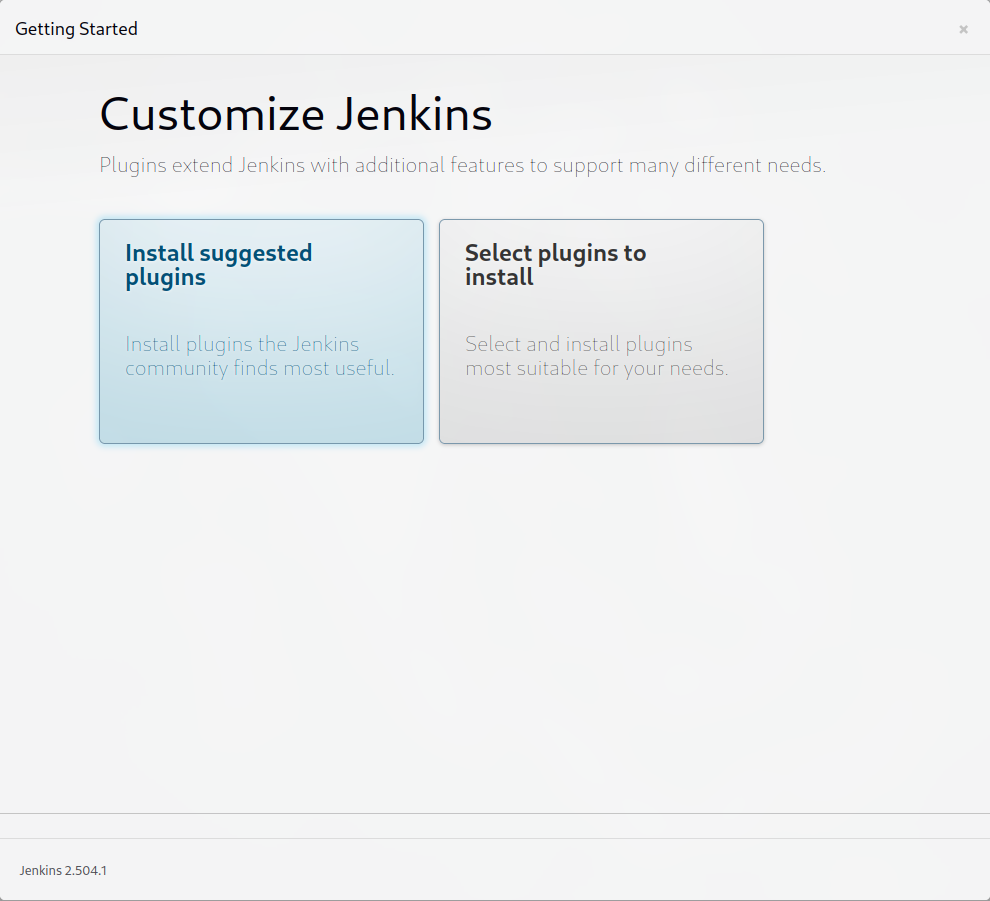

## Create First Admin User

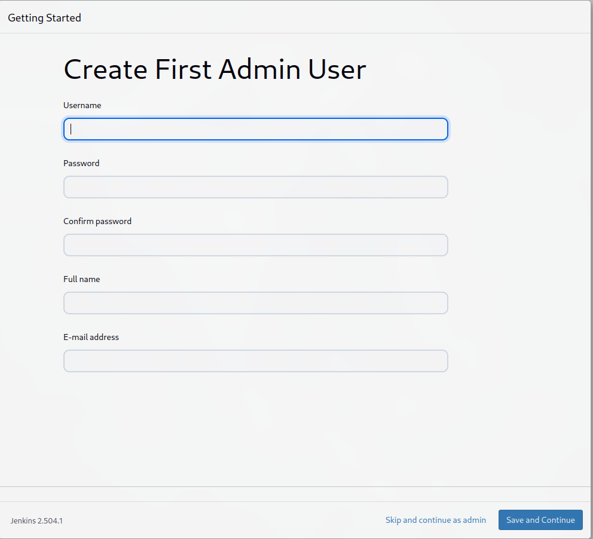

## Instance Configuration

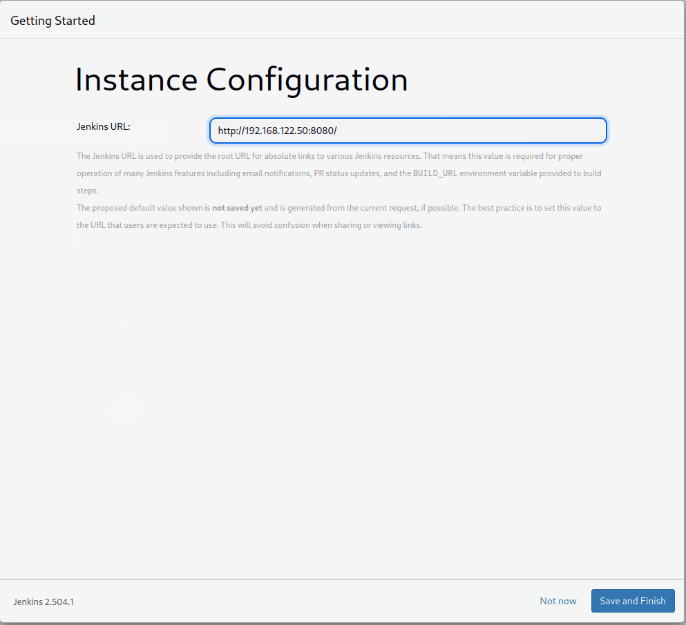

---

# Manage Jenkins

## Security

### Credentials

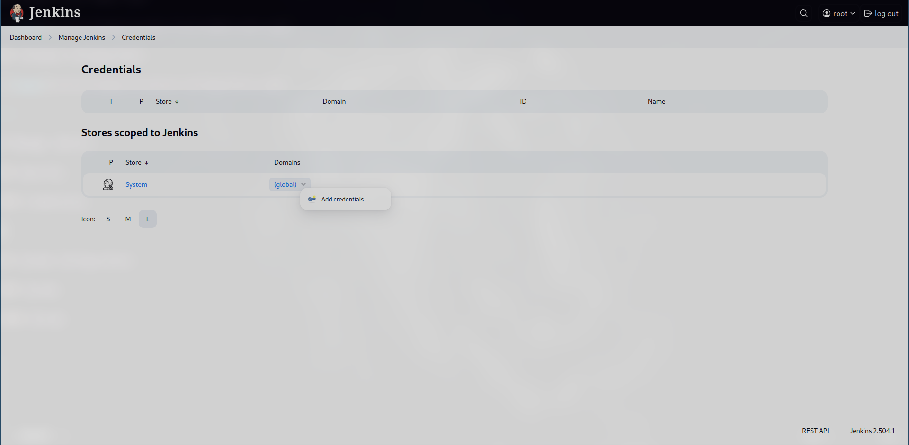
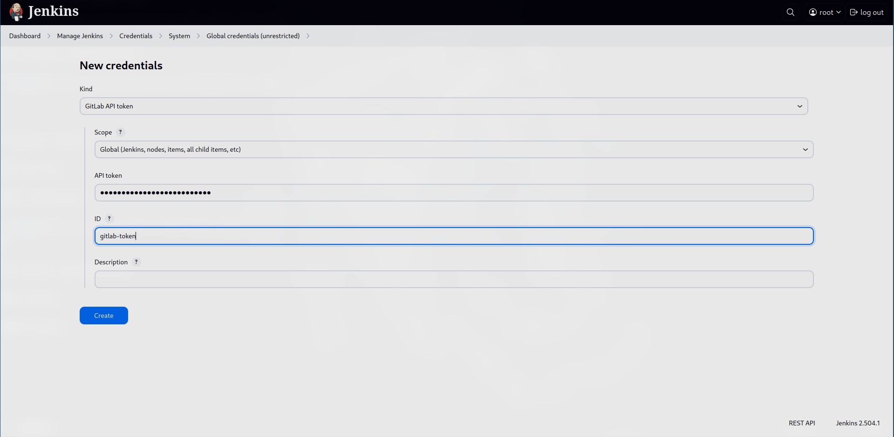

## System Configuration

### System 

#### GitLab

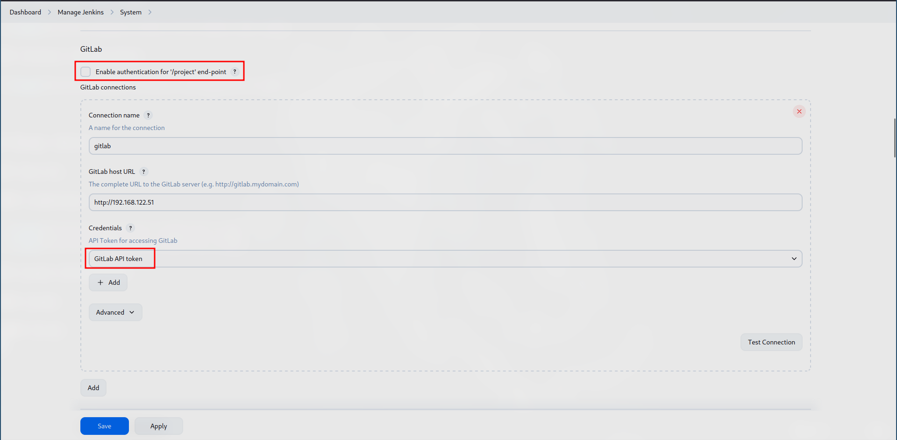
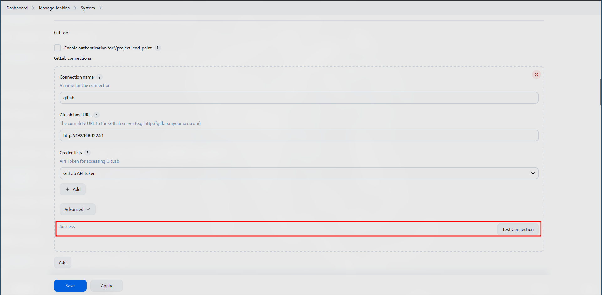

---

# New Item

## Pipeline

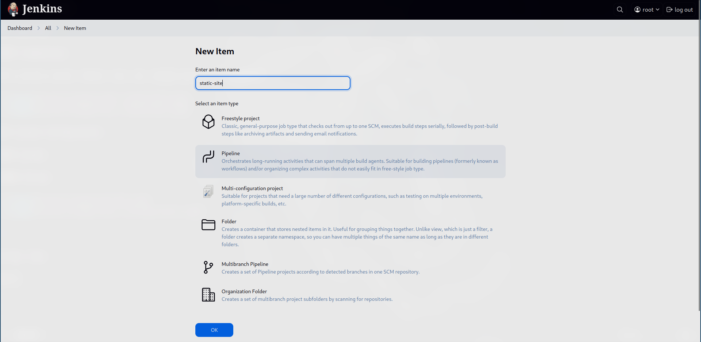
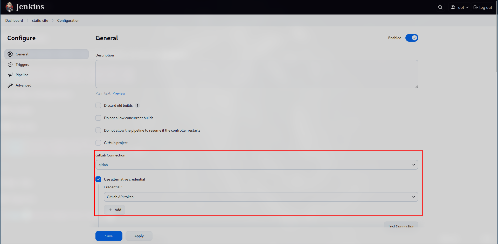

GitLab webhook URL is very important, we will use in GitLab configuration

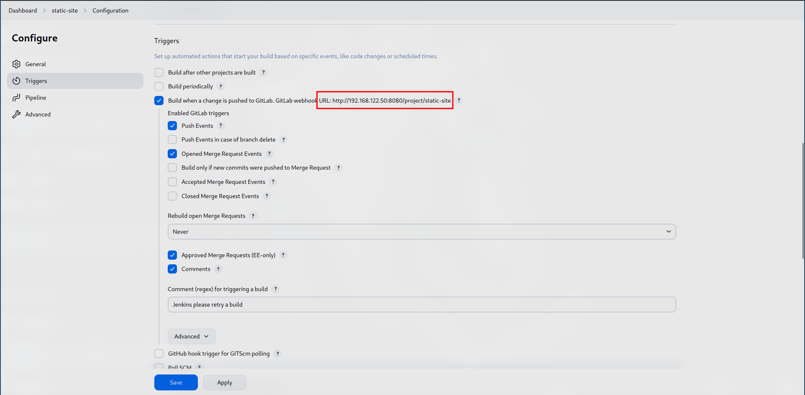
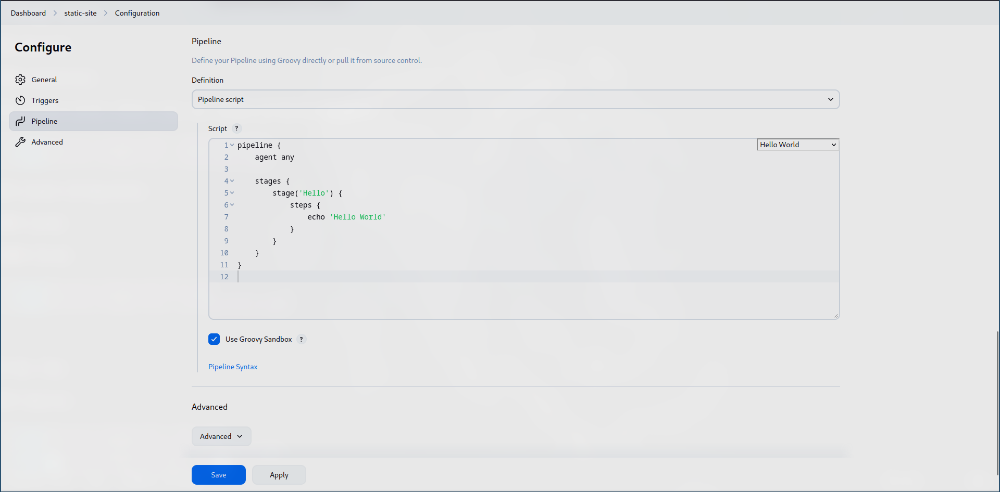

---
